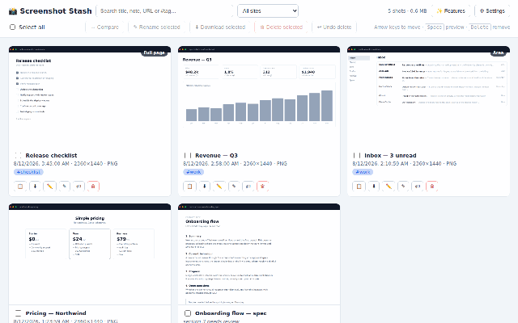

# Screenshot Stash

A Chrome extension that lets you take screenshots of any tab as you browse, collects them into a
library, and lets you review them whenever you like — copying, downloading, annotating, or
deleting them one at a time or in bulk.

## Features

- **Three capture modes**, from the toolbar popup or a keyboard shortcut:
  - **Visible tab** — `Alt+Shift+S`
  - **Full page** — `Alt+Shift+F`; scrolls the page and stitches one tall screenshot, and
    handles apps that scroll an inner panel rather than the document
  - **Select area** — `Alt+Shift+R`; drag a rectangle to capture just that part
  - All three are remappable from the **⌨ Shortcuts** button in the library.
- **Library page** showing every screenshot as a card with its title, note, capture time,
  dimensions and format. Click a thumbnail for a full-size preview.
- **Search & filter** by title, note, URL, `#tag`, or site.
- **Rename and annotate notes**, one at a time or across a whole selection — bulk rename numbers
  them for you, so `work` becomes `work_1`, `work_2`, `work_3`.
- **Per-screenshot actions**: copy, download, annotate, rename, tag, or delete — with a 6-second
  **Undo** after every delete.
- **Annotate** with pen, arrows, boxes, and pixelated blur to hide sensitive information, then
  save over the original or as a copy.
- **Bulk actions**: select with checkboxes (or **Select all**), then rename, download or delete
  the whole selection. Select exactly two to **compare side by side**.
- **Keyboard navigation** — arrow keys move between screenshots, <kbd>Space</kbd> previews,
  <kbd>Delete</kbd> removes, <kbd>Enter</kbd> toggles selection.
- **Drag a screenshot out** of the library straight into Slack, Figma, or an email.
- **Choose your format** — PNG, WebP or JPEG. A tall full-page PNG can run to tens of megabytes;
  WebP is roughly ten times smaller on photo-heavy pages.
- **Export all** — download the entire library as a single zip.
- **Duplicate detection** — near-identical captures get a "≈ duplicate" badge.
- **Storage meter** and optional **auto-delete** of screenshots older than 7/30/90 days
  (runs locally, off by default).
- **Dark mode** — follows your system theme.
- **Badge counter** on the toolbar icon showing how many screenshots are stashed.

## Installation (unpacked)

1. Clone or download this repository.
2. Open Chrome and go to `chrome://extensions`.
3. Enable **Developer mode** (toggle in the top-right corner).
4. Click **Load unpacked** and select this repository's folder.

## Usage

1. Browse to any page and press **Alt+Shift+S**, or click the extension icon and pick a capture
   mode. The badge flashes `+1` when the capture is saved.
2. Click the extension icon → **Open library** to review your screenshots.
3. Search, filter, tag, annotate, compare, and use the per-card or bulk actions.

Downloads are saved to `Downloads/screenshot-stash/` with timestamped filenames.

> **Note:** Chrome does not allow capturing its own internal pages (`chrome://…`, the Web Store,
> etc.); the extension reports this instead of saving a blank image.

## Privacy

Your screenshots **never leave your device**. They are stored only in your browser's local
storage (IndexedDB) inside your Chrome profile — no servers, no accounts, no uploads, no
analytics, and no network requests of any kind. Deleting a screenshot (or uninstalling the
extension) removes it immediately and permanently; no copy is retained anywhere. The only ways
an image leaves the library are the **Download**, **Copy**, and **Export** buttons you click
yourself.

See [PRIVACY.md](PRIVACY.md) for the full policy.

## Project layout

| File                       | Purpose                                                  |
| -------------------------- | -------------------------------------------------------- |
| `manifest.json`            | Manifest V3 definition                                   |
| `background.js`            | Service worker: shortcut, badge, long captures, cleanup  |
| `capture.js`               | Visible / full-page / area capture + duplicate hashing   |
| `db.js`                    | IndexedDB storage layer                                  |
| `settings.js`              | Shared user settings: format, quality, cleanup, auto-copy|
| `zipper.js`                | Minimal ZIP writer for Export all                        |
| `popup.html/css/js`        | Toolbar popup: capture buttons, recent thumbnails        |
| `library.html/css/js`      | Library: review, search, tags, bulk actions, compare     |
| `editor.html/css/js`       | Annotation editor: pen, arrow, box, blur                 |
| `icons/`                   | Extension icons                                          |
| `store-assets/`            | Chrome Web Store listing screenshots (not shipped)       |
| `docs/`                    | README demo GIF (not shipped)                            |

**Packaging note:** when zipping for the Chrome Web Store, exclude `store-assets/`, `docs/`,
and `.git/` — only the extension files belong in the upload.
